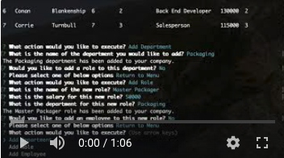

# Employee_Tracker

## CONCEPTUALIZING THE SCOPE

The first challenge for this exercise was understanding the full scope of data I would need to return and/or render. With a dynamic inquirer app, every input or resposne needs to be either looped back to the main menu or provided with the appropriate follow-up. Each input then needs to make the proper connection query and either return or edit the appropraite data. To be honest, it seems the tables provided were intentionally convoluted. My guess is that this was to provide additional practice in working with mysql. For the sake of practice, I decided not to just create left join tables for every query, though that probably would have been the cleanest way coplete the homework. Instead, I used this as an opportunity to make nested calls to multiple different tables and extrapolate information as needed.

## SETTING UP INQUIRER

I can say that I am officially over inquirer. It is a nifty tool, but it is getting annoying. I set up my inquirer so that the actual functionality of the app would be as simple as possible. After creating my inquirer objects and functions to execute the appropriate calls, I set everything into a series of if/else ifs. The whole app is basically run with this code:

```
  const mainMenu = () => {
    inquirer.prompt(mainMenuSelect).then((response) => {
      //if add department
      if (response.menu === "Add Department") {
        addNewDepartment();
      }
      //if add role
      else if (response.menu === "Add Role") {
        addNewRole();
      }
      //if add employee
      else if (response.menu === "Add Employee") {
        addNewEmployee();
      }
      //if view departments
      else if (response.menu === "View Employees by Department") {
        store.viewDepartmentsDB();
        setTimeout(mainMenu, 4000);
      }
      //if view roles
      else if (response.menu === "View Employees by Role") {
        store.viewRolesDB();
        setTimeout(mainMenu, 4000);
      }
      //if view employees
      else if (response.menu === "View All Employees") {
        store.viewEmployeesDB();
        setTimeout(mainMenu, 4000);
      }
    });
  };
```

## EXTRA CLASS WORK

I decided to use a Class to help organize some of my functions. My goal in creating this class was to have all functions that made connection queries in one place. Barring two functions, it seems to have worked. The issue I ran into with those two functions is that they referenced functions from my inquirer doc that were necessary for the running of the inquirer doc. I tried to export those functions to my class doc so I could call them, but couldnt figure out how to get them to work. The reuslt is a mostly cleaner doc, but I still need to refactor the code a bit.

## ANOTHER WEIRDLY WRITTEN ASSIGNMENT

This was another one of those instances where the assignment was a bit difficult to understand. For example, one of the requirements was to be able to "update employee rolls." It was listed as if it should be an option to select in inquirer, but it wasn't explained any further. It is also not among the options in the demo provided. I decided that this just meant that if I were to add a department, role, or employee, when I then selected one of the view employee options, those udpates would be reflected.

## STILL WORKING ON IT

I need to figure out how to clean up the issue I had with my Class. If I'm going to use a Class, I'd like to get all relevant functions into that class.

This homework didn't ask for data validation. If I had more time, I probably would add datavalidation for the inquirer resonses to ensure that there were no blanks, integers when required, strings when required, and that there were no duplicate answers provided.

## THE APP:

[](https://youtu.be/pqUVb0H23CY)
